  

## Hi there 🐈

I'm swimming in the ocean, forever and ever...

| I am a ... |
|:-:|
| Full-stack developer |
| Funny OSS developer |
| OSS contributor |
| Developer community staff |

My portfolio: https://otoneko.cat

## Stats

### Skills:

All my skills: https://otoneko.cat#skills

### GitHub:

  <!--
    https://github-readme-stats.oto.im/api?username=otoneko1102&show_icons=true&count_private=true&theme=onedark
  -->
  
  <!--
    https://github-readme-stats.oto.im/api/top-langs/?username=otoneko1102&langs_count=20&show_icons=true&count_private=false&layout=compact&theme=onedark
  -->
  

<!--
  https://github-profile-trophy.oto.im/?username=otoneko1102&theme=onedark&count_private=true&column=10
-->

### Code:

  

Details of WakaTime

<!--
  https://github-readme-stats.oto.im/api/wakatime?username=otoneko1102&layout=compact&theme=dark
-->

### Discord:

## Please Donate

## Contact

- [Twitter: @rin_pineapple](https://twitter.com/rin_pineapple)
- [Twitter: @rin_montblank](https://twitter.com/rin_montblank)

## Others

Click to Open

### Developer community

Tech topics & chat  

|  |  |
|:-:|:-:|
|
I'm a staff ... 
|
Ny own ... 
|

